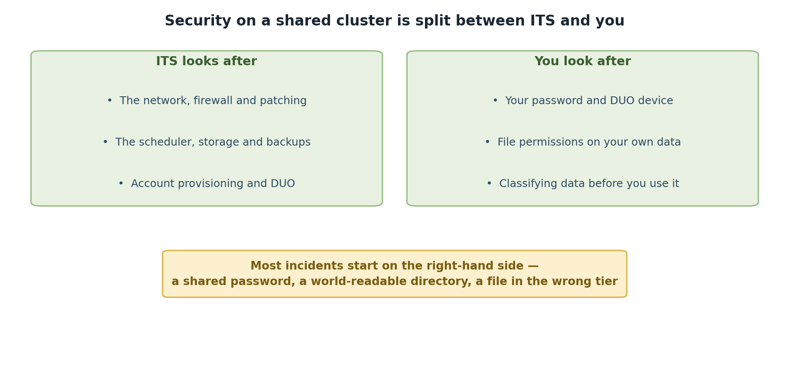

:::::::::::::::::::::::::::::::::::::: questions
- What does HPC security mean?
- What are your responsibilities as an HPC user?
- Why does account suspension happen without security training?
::::::::::::::::::::::::::::::::::::::::::::::::

::::::::::::::::::::::::::::::::::::: objectives
- Understand your role in HPC security
- Recognize shared security responsibilities
- Understand why this training is mandatory
- Identify key security concepts
::::::::::::::::::::::::::::::::::::::::::::::::

## Welcome to HPC Security Training

This is a mandatory workshop for all Pomona College HPC users. Your account will be suspended if this training is not completed within 30 days of account activation.

This isn't about rules to restrict you. It's about protecting:
- Your research data
- Your collaborators' data
- Student data (FERPA protection)
- Pomona's computing infrastructure
- Our college's reputation and compliance

{alt='Two panels. ITS looks after the network, firewall and patching, the scheduler, storage and backups, and account provisioning and DUO. You look after your password and DUO device, file permissions on your own data, and classifying data before you use it. A note observes that most incidents start on the user side: a shared password, a world-readable directory, or a file in the wrong tier.'}

## What is HPC Security?

HPC security means protecting research and sensitive data from:

- **Accidental loss**: Hard drives fail, data gets deleted
- **Unauthorized access**: Passwords compromised, attackers exploit systems
- **Data exposure**: Sensitive information exposed publicly
- **Compliance violations**: Breaking laws or policies
- **System compromise**: Malware or exploited systems

## The Shared Responsibility Model

HPC security is NOT just the HPC staff's job. Everyone has responsibilities:

### HPC Staff Responsibility

- Maintain secure infrastructure
- Manage authentication systems
- Monitor for attacks and intrusions
- Keep software updated
- Handle incidents professionally

### YOUR Responsibility

- Keep passwords secure
- Use multi-factor authentication
- Handle data appropriately
- Report suspicious activity
- Follow security policies
- Ask for help when uncertain

::::::::::::::::::::::::::::::::::::: callout
## Critical: Your Role is Essential

Security professionals can build perfect systems, but one weak password or one careless data transfer undermines everything. Your actions directly impact Pomona's security. This training exists because YOUR vigilance matters most.
::::::::::::::::::::::::::::::::::::::::::::::::

## Why This Training is Mandatory

**Account suspension without completion is not arbitrary.** Here's why:

1. **Legal compliance**: FERPA, export control, other laws
2. **Data protection**: Student information requires protection
3. **Insurance requirements**: Pomona's cyber insurance mandates training
4. **Professional standards**: Universities must demonstrate due diligence
5. **Collective security**: One compromised account affects everyone

Completing this training shows you understand your role in protecting the community.

## Key Security Principles

### 1. Know Your Data Classification

Data falls into three tiers:

- **PUBLIC** (green; permissions 755): Can be freely shared
- **PROPRIETARY** (orange; permissions 750): Restricted to authorized people; includes unpublished research
- **RESTRICTED** (red; permissions 700 + gocryptfs): Student records, medical, financial data

Different data requires different protection levels.

### 2. Least Privilege

Users get minimum access needed for their work. You don't have admin access to cluster nodes. This isn't to frustrate you; it's to limit damage if your account is compromised.

### 3. Defense in Depth

Single security measures fail. We use multiple layers:

- Passwords (knowledge you have)
- Multi-factor authentication (something you possess)
- Encryption (protecting data itself)
- Access controls (who can access what)

### 4. Think Before You Click

The strongest security measure is awareness:

- Don't share passwords
- Don't open suspicious attachments
- Verify unusual requests
- Report suspicious activity

## Your Path to Secure HPC Use

This workshop covers:

1. **Acceptable Use Policy** - What's allowed and what's not
2. **Authentication** - How to secure your account
3. **Data Handling** - Protecting research information
4. **Incident Reporting** - What to do if something goes wrong
5. **Getting Help** - Resources for security questions

## Important Dates

- **Account created**: Day 0
- **Training deadline**: Day 30
- **Account suspension**: Day 31 if training incomplete
- **Re-activation**: After completing training

::::::::::::::::::::::::::::::::::::: callout
## Warning: 30-Day Deadline is Real

This is not a suggestion. Accounts are automatically suspended after 30 days if training is incomplete. Re-activation requires completing all episodes. Plan to finish this training within the first two weeks after your account is created.
::::::::::::::::::::::::::::::::::::::::::::::::

## Common Questions

**Q: Is this security training required every year?**
A: No, just once during onboarding. But security reminders happen periodically.

**Q: What if I'm too busy to complete in 30 days?**
A: Contact its-hpc@pomona.edu to request extension (rare circumstances only).

**Q: Does completing training guarantee security?**
A: No, but it dramatically improves security. Your ongoing vigilance matters most.

**Q: What if I don't understand something?**
A: Stop and ask its-hpc@pomona.edu. Honest questions are encouraged.

::::::::::::::::::::::::::::::::::::: challenge

## Challenge: Reflect on Your Responsibilities

Think about your research and computing:

1. What types of data will you work with?
2. Who else has access to this data?
3. What would happen if your password was compromised?
4. Where would you report a security problem?

Write 2-3 sentences about why HPC security matters for YOUR work.

:::::::::::::::::::::::::::::::: solution

There is no wrong answer to this challenge. Good answers mention:

- Recognition that research data has value and needs protection
- Understanding that others depend on security
- Awareness that mistakes happen and have consequences
- Willingness to follow procedures
- Recognition that security is everyone's responsibility

Examples:

- "My dataset represents 6 months of lab work; losing it would be catastrophic."
- "Student privacy depends on secure systems."
- "If my account is hacked, it could compromise the whole lab's work."

:::::::::::::::::::::::::::::::::

::::::::::::::::::::::::::::::::::::::::::::::::

## Next Steps

Now that you understand *why* security matters, let's learn *how* to maintain security. Continue to Episode 2.

::::::::::::::::::::::::::::::::::::: keypoints

- HPC security protects your research, your collaborators, and students
- Security is a shared responsibility between staff and users
- This mandatory training ensures everyone understands their role
- Account suspension without training completion is not arbitrary
- Your ongoing vigilance is the strongest security measure

::::::::::::::::::::::::::::::::::::::::::::::::
