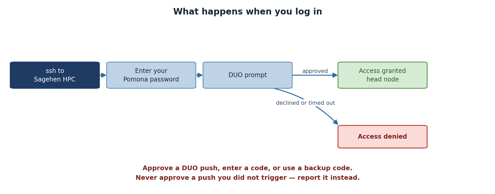

:::::::::::::::::::::::::::::::::::::: questions

- How do you secure your HPC account?
- What is multi-factor authentication?
- Why is DUO MFA required?
- How do you protect your password?

::::::::::::::::::::::::::::::::::::::::::::::::

::::::::::::::::::::::::::::::::::::: objectives

- Understand password security best practices
- Set up and use DUO Multi-Factor Authentication
- Recognize phishing and social engineering attacks
- Know what to do if credentials are compromised

::::::::::::::::::::::::::::::::::::::::::::::::

## Account Security Fundamentals

Your HPC account is the key to Sagehen. Securing it protects your research and others' data.

{alt='A login flow. You ssh to Sagehen HPC, enter your Pomona password, and reach a DUO prompt. If approved, access is granted to the head node. If declined or timed out, access is denied. A note says to approve a push, enter a code, or use a backup code, and never to approve a push you did not trigger.'}

## Strong Passwords

A good password:

- **Is long** (14+ characters, per NIST SP 800-63B)
- **Is random** (mix letters, numbers, symbols)
- **Is unique** (different from other accounts)
- **Is NOT**: Your name, birthday, pet name, dictionary words
- **Is NOT**: Reused from other accounts

### Password Examples

**BAD**: MyPassword123 (predictable pattern)
**BAD**: Fluffy2024 (pet name + year)
**BAD**: SamSmith1955 (real name + date)

**GOOD**: Tr0pic@l*Penguin#42 (random, mixed characters, memorable)
**GOOD**: 7Qk&mL2pX$9Yw2 (random string)
**GOOD**: My-Dog-Ate-11-Socks! (memorable passphrase)

### Password Security Rules

- **Never share** your password with anyone (not even staff)
- **Never write it down** except in encrypted password manager
- **Never type it in email** even to support staff
- **Never use at work** in front of others
- **Change immediately** if you suspect it's exposed
- **Don't reuse** passwords across multiple accounts

::::::::::::::::::::::::::::::::::::: callout
## Critical: Staff Will Never Ask for Your Password

If anyone claiming to be HPC staff, IT support, or Pomona administration asks for your password via email, phone, or chat: **DO NOT GIVE IT**. Legitimate staff will never ask. This is a phishing attempt or social engineering attack. Report it to its-hpc@pomona.edu immediately.
::::::::::::::::::::::::::::::::::::::::::::::::

## Password Managers

Use a password manager to secure strong passwords:

- **LastPass**, **1Password**, **Bitwarden**, **KeePass**
- Store complex passwords you can't memorize
- One master password protects all
- Available on computer and phone
- Industry standard for security professionals

## Multi-Factor Authentication (MFA)

MFA (also called 2FA or two-factor auth) adds a second security layer:

1. **Something you know**: Password
2. **Something you have**: Phone or security key
3. **Something you are**: Biometrics (optional)

### DUO MFA at Pomona

The College requires DUO Multi-Factor Authentication for HPC access.

**How DUO works**:

1. You enter username and password
2. DUO sends notification to your phone
3. You approve the login on your phone
4. Login completes

Or you can enter a code from authenticator app instead.

### Setting Up DUO

1. Go to https://duo.pomona.edu
2. Log in with Pomona credentials
3. Follow DUO enrollment process
4. Choose method:
   - DUO mobile app (best - works offline)
   - Phone call (always works)
   - Text message (backup)
5. Test authentication

### Using DUO for HPC

Every time you access HPC via OnDemand:

1. Enter Pomona credentials
2. DUO prompt appears on your phone
3. Approve the login
4. You're logged in

For SSH access:
```
ssh <myusername>@sagehen.hpc.pomona.edu
# DUO prompt appears on phone
# Approve → SSH login succeeds
```

### DUO Best Practices

- **Keep your phone with you** - you need it to approve logins
- **Update DUO app** when prompted
- **Use backup method** - set up phone call as backup to app
- **Don't decline prompts** if you didn't try to log in (potential attack)
- **Report if lost** - contact ITS if phone is lost/stolen

## Session Security

Once logged in, maintain security:

### Session Timeout

- **OnDemand**: Auto-logout after inactivity (typically 1-2 hours)
- **SSH**: No automatic logout (user responsible)
- **Jupyter/RStudio**: Browser-based, follows browser security

### Sharing Devices

Never leave yourself logged in on shared computers:

- **Always log out** when finished
- **Clear browser cache** if asked
- **Close all windows** before leaving
- **Don't check "remember me"** on shared computers

### Remote Access

When accessing from public WiFi:

- **Use VPN** if possible (check with ITS)
- **Assume network is monitored** (don't do sensitive operations)
- **Never work with passwords** unless VPN is active
- **Lock screen** if you leave keyboard

## Recognizing and Preventing Attacks

### Phishing Emails

Fake emails trying to steal credentials:

**Red flags**:

- Urgent language ("Act now!")
- Unusual requests (verify login, click link)
- Generic greetings ("User" instead of your name)
- Suspicious sender address
- Requests to verify password/PIN
- Too-good-to-be-true offers

**Real organizations never ask you to verify credentials via email.**

**What to do**:

1. Don't click any links
2. Don't download attachments
3. Report to its-hpc@pomona.edu
4. Delete the email

### Social Engineering

Attackers may call or email claiming to be:

- "IT support" asking for password
- "HPC team" requesting access
- "From your department" needing confirmation
- "Pomona security" checking accounts

**Remember**: Legitimate staff never ask for passwords via email/phone.

**What to do**:

1. Say "I'll contact ITS directly"
2. Hang up or close email
3. Call actual ITS number from official directory
4. Verify the request

### Malware and Unsafe Sites

Risks from visiting suspicious websites or downloading files:

**Prevention**:

- Use updated browser and antivirus
- Don't download files from untrusted sources
- Don't visit sketchy websites
- Be suspicious of ads and popups
- Keep operating system updated

## If Your Credentials Are Compromised

**Immediately**:

1. **Stop what you're doing**
2. **Change your password** right now
3. **Contact its-hpc@pomona.edu** - include details
4. **Check account activity** - look for unexpected jobs/files
5. **Don't panic** - you're not alone; this happens

::::::::::::::::::::::::::::::::::::: callout
## Act Fast: First Minutes Are Critical

If you suspect your password is compromised, changing it immediately limits the damage window. Waiting even a few hours gives attackers time to access data or submit malicious jobs. Treat password compromise like a true emergency: stop, change password, report. Speed matters.
::::::::::::::::::::::::::::::::::::::::::::::::

**What HPC staff will do**:

- Check for suspicious activity
- Review job history
- Scan for malware
- Help reset access
- Provide guidance

**Note**: The earlier you report, the better.

::::::::::::::::::::::::::::::::::::: challenge

## Challenge: Security Decision-Making

For each scenario, decide what you would do:

1. You receive email from "ITS Security" asking you to verify password
2. You use the same password on your HPC account and your Gmail
3. You're at a coffee shop; your laptop is at table while you get coffee
4. You get DUO push notification you didn't trigger
5. You find a USB drive in a parking lot

Explain your decision for each.

:::::::::::::::::::::::::::::::: solution

1. **"ITS Security" email**: DELETE IT - never reply, never click links. Call ITS directly using official phone number. This is a phishing attempt.
2. **Same password everywhere**: CHANGE IMMEDIATELY - if one account is breached, all are at risk. Use unique strong passwords for each important account.
3. **Laptop unattended**: LOCK YOUR LAPTOP - use Ctrl+Alt+Delete (Windows) or equivalent. Never leave unlocked in public.
4. **Unexpected DUO notification**: DENY IT - don't approve logins you didn't initiate. Contact its-hpc@pomona.edu immediately. Someone may have your password.
5. **USB drive found**: DO NOT PLUG IN - could contain malware or data you should not see. Bring to ITS, they'll handle safely.

:::::::::::::::::::::::::::::::::

::::::::::::::::::::::::::::::::::::::::::::::::

## Testing Your Security Knowledge

Verify you understand:

- What constitutes a strong password
- How to set up and use DUO
- How to recognize phishing
- What to do if account is compromised

If you're unsure about any of these, review or ask its-hpc@pomona.edu.

::::::::::::::::::::::::::::::::::::: keypoints

- Strong, unique passwords are essential; use a password manager
- DUO Multi-Factor Authentication adds critical security layer
- Phishing and social engineering are common; recognize and report
- Log out when finished, especially on shared computers
- If credentials are compromised, contact ITS immediately
- Legitimate staff never ask for passwords via email/phone

::::::::::::::::::::::::::::::::::::::::::::::::

<!-- highlight <labname>/<myusername> placeholders in code blocks; remove if the varnish theme handles this natively -->
<script>(function(){var CSS='.sh-placeholder{color:#c2410c;font-weight:700}[data-bs-theme="dark"] .sh-placeholder,html.dark .sh-placeholder{color:#fdba74}@media (prefers-color-scheme: dark){[data-bs-theme="auto"] .sh-placeholder{color:#fdba74}}';var RX=/<labname>|<myusername>/g;function firstMatch(el){var w=document.createTreeWalker(el,NodeFilter.SHOW_TEXT,null),nodes=[],full='';while(w.nextNode()){nodes.push({n:w.currentNode,s:full.length});full+=w.currentNode.nodeValue;}RX.lastIndex=0;var m;while((m=RX.exec(full))){var s=m.index,e=s+m[0].length,inSpan=false,parts=[];for(var j=0;j<nodes.length;j++){var ns=nodes[j].s,ne=ns+nodes[j].n.nodeValue.length;if(ne<=s||ns>=e)continue;parts.push({node:nodes[j].n,a:Math.max(s-ns,0),b:Math.min(e-ns,nodes[j].n.nodeValue.length)});var p=nodes[j].n.parentNode;while(p&&p!==el){if(p.classList&&p.classList.contains('sh-placeholder')){inSpan=true;break;}p=p.parentNode;}}if(!inSpan&&parts.length)return parts;}return null;}function wrapParts(parts){for(var i=parts.length-1;i>=0;i--){var t=parts[i].node,txt=t.nodeValue,a=parts[i].a,b=parts[i].b;var span=document.createElement('span');span.className='sh-placeholder';span.textContent=txt.slice(a,b);var f=document.createDocumentFragment();if(a>0)f.appendChild(document.createTextNode(txt.slice(0,a)));f.appendChild(span);if(b<txt.length)f.appendChild(document.createTextNode(txt.slice(b)));t.parentNode.replaceChild(f,t);}}function run(){var st=document.createElement('style');st.textContent=CSS;document.head.appendChild(st);document.querySelectorAll('pre,code').forEach(function(el){var guard=0,parts;while((parts=firstMatch(el))&&guard++<500){wrapParts(parts);}});}if(document.readyState==='loading'){document.addEventListener('DOMContentLoaded',run);}else{run();}})();</script>
