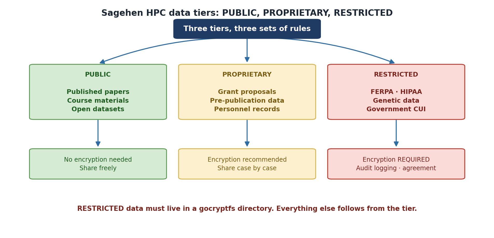
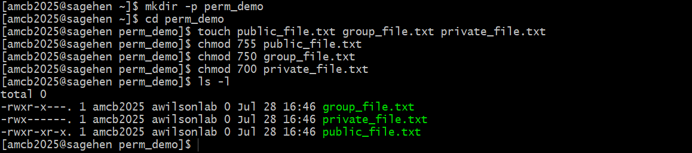

:::::::::::::::::::::::::::::::::::::: questions
- What are data classification levels?
- How should different data be stored?
- When is encryption required?
- What is restricted data?
::::::::::::::::::::::::::::::::::::::::::::::::

::::::::::::::::::::::::::::::::::::: objectives
- Understand Pomona's data classification system
- Classify your research data appropriately
- Know when encryption is required
- Understand FERPA and export control implications
::::::::::::::::::::::::::::::::::::::::::::::::

## Data Classification at Pomona

All data falls into one of three categories:

### PUBLIC Data (green; permissions 755)

**Definition**: Can be freely shared with anyone.

**Examples**:

- Published research results
- Public documentation
- General information materials
- Already published datasets
- Data explicitly released for public use

**Storage**: Can use /rhome or /bigdata

**Sharing**: No restrictions

**Access**: Everyone

**Permissions**: 755

**Encryption**: Not required

### PROPRIETARY Data (orange; permissions 750)

**Definition**: Restricted to specific authorized individuals; includes unpublished research and draft work.

**Examples**:

- Draft research papers and manuscripts
- Lab notebooks and preliminary analysis
- Unpublished research data
- Confidential partnership data
- Patentable research
- Data under non-disclosure agreement (NDA)
- Data from industry partner
- Restricted by contract

**Storage**: /bigdata with access controls

**Sharing**: Only with authorized people (specified in contract)

**Access**: Explicitly listed individuals

**Permissions**: 750

**Encryption**: Recommended, sometimes required

### RESTRICTED Data (red; permissions 700 + gocryptfs)

**Definition**: Highly sensitive; requires maximum protection.

**Examples**:

- FERPA data (student records, grades, ID numbers)
- Medical information (HIPAA if applicable)
- Social Security numbers
- Financial information (credit cards, bank accounts)
- Export-controlled research
- Personal identifying information combined with sensitive data

**Storage**: Must use /bigdata with strict access controls

**Sharing**: Only with explicitly authorized people

**Access**: Minimum necessary basis

**Permissions**: 700 + gocryptfs

**Encryption**: MANDATORY - use gocryptfs

{alt='The three Sagehen HPC data tiers. PUBLIC covers published papers, course materials and open datasets, needs no encryption and can be shared freely. PROPRIETARY covers grant proposals, pre-publication data and personnel records, with encryption recommended and sharing decided case by case. RESTRICTED covers FERPA and HIPAA data, genetic data and government CUI, where encryption is required along with audit logging and an agreement. A note adds that RESTRICTED data must live in a gocryptfs directory.'}

## Data Classification Decision Tree

Ask yourself:

1. **Is this already published?** → PUBLIC
2. **Can anyone access it?** → PUBLIC
3. **Does it contain FERPA data?** → RESTRICTED (Encryption Required!)
4. **Is it under NDA or contract?** → PROPRIETARY
5. **Is it unpublished research or draft work?** → PROPRIETARY
6. **Is it ongoing research or lab-only work?** → Usually PROPRIETARY

## FERPA Protection

**FERPA** = Family Educational Rights and Privacy Act

FERPA protects student privacy:

### Protected Information

- Student ID numbers
- Grades and academic records
- Financial aid information
- Disciplinary records
- Personal notes/comments about students

### Your Responsibility

If you work with student data:

- **Minimum necessary**: Only access data you need
- **Secure storage**: Must use encryption (gocryptfs)
- **Restricted sharing**: Never share with unauthorized people
- **Retention limits**: Delete when no longer needed
- **Data agreement**: Sign data use agreement if required

### FERPA Violations

Unauthorized access to or sharing of FERPA data:

- Violates federal law
- Results in account suspension
- May result in disciplinary action
- Creates liability for college

**If you accidentally access FERPA data**: Report immediately to its-hpc@pomona.edu

::::::::::::::::::::::::::::::::::::: callout
## FERPA: Federal Law, Not Just Policy

Student data protection is not just Pomona policy. FERPA is federal law with real legal consequences. Violating FERPA can result in personal legal liability, not just account suspension. If you work with student records, contact your PI immediately about proper handling procedures and required encryption.
::::::::::::::::::::::::::::::::::::::::::::::::

## Export Control Considerations

Some research is restricted by federal export control laws:

### Restricted Research Includes

- Encryption and security research
- Certain physics/materials science work
- Semiconductor/chip technology research
- Military applications
- Some AI/machine learning research

### If Your Research is Restricted

- **Don't assume**: Ask your PI and compliance office
- **Follow controls**: May restrict access to non-US persons
- **Communicate limits**: Mark restricted data clearly
- **Report violations**: Contact compliance office immediately

**Contact**: Your department compliance officer or its-hpc@pomona.edu

## File Permissions and Access Control

Set appropriate file permissions:

```
chmod 700 ~/restricted_data   # Only you can access
chmod 750 ~/group_data        # You and group can access
chmod 755 ~/shared_data       # Everyone can read
chmod 644 ~/readme.txt        # Everyone can read, only you write
```

{alt='A terminal session creating a demo directory with three empty files and applying chmod 755, 750, and 700. The ls -l output shows one file readable by everyone, one accessible to the owner and the lab group, and one accessible only to the owner.'}

### General Rules

- **Default**: Restrict access to minimum necessary
- **RESTRICTED data**: 700 + gocryptfs (user only, encrypted)
- **PROPRIETARY data**: 750 (user and group)
- **PUBLIC data**: 755 (everyone can read)
- **Never**: 777 (world-writable is dangerous)

## Using gocryptfs for RESTRICTED Data

If storing RESTRICTED data (FERPA, medical, etc.), encrypt it with gocryptfs.

**See Workshop 15 for detailed gocryptfs training.**

Basic process:

```
gocryptfs -init /cipher
gocryptfs /cipher /plain
# Work with files in /plain directory
fusermount -u /plain
```

::::::::::::::::::::::::::::::::::::: callout
## Important: Encryption is Mandatory, Not Optional

If you're storing RESTRICTED data (student records, medical information, etc.), encryption with gocryptfs is not optional. It's a requirement. Storing unencrypted restricted data violates federal law and Pomona policy. Failure to encrypt can result in account suspension and personal liability.
::::::::::::::::::::::::::::::::::::::::::::::::

## Data Retention and Deletion

### Keep Data While Needed

- **Active research**: Keep on HPC
- **Completed research**: Archive to /bigdata with backups
- **No longer needed**: Delete securely

### Delete Safely

```
shred -uvfz filename    # Overwrite before deleting (best effort -- see below)
rm filename             # Then remove file
```

::::::::::::::::::::::::::::::::::::::: callout

## `shred` Is Best-Effort on BeeGFS

On a parallel network filesystem like BeeGFS, `shred` cannot guarantee that
the *physical* storage blocks are overwritten -- the filesystem may write the
overwrite passes elsewhere. Treat `shred` as a best-effort measure. For
RESTRICTED data the real protection is encryption: keep the data in a
gocryptfs directory, and securely destroying the key material
(`gocryptfs.conf` and its backups) renders the ciphertext permanently
unreadable regardless of what remains on disk.

:::::::::::::::::::::::::::::::::::::::::::::::


For large datasets:

- Note: /scratch is auto-deleted when the job completes; there is no grace period for storage cleanup. For longer-term storage, use /bigdata or /rhome.
- For secure deletion of files outside /scratch, `shred -uvfz filename` (or `dd if=/dev/zero of=filename` then `rm`) is best effort on BeeGFS -- for RESTRICTED data rely on gocryptfs encryption and key destruction instead

### Backup Strategy

- **Active data**: Stored in /bigdata with backups
- **Published results**: Archive copies with institution
- **Personal copies**: External drive with encryption
- **Sensitive data**: Encrypted backups only

## Identifying Your Data Classification

Before storing research data on HPC:

1. **Discuss with PI** - Determine proper classification
2. **Check requirements** - FERPA, NDA, export control, contracts
3. **Choose location** - /rhome vs /bigdata
4. **Set permissions** - Restrict to necessary parties
5. **Consider encryption** - Required for RESTRICTED, recommended for others
6. **Document decision** - Keep note of classification reasoning

::::::::::::::::::::::::::::::::::::: challenge

## Challenge: Classify Research Data

For each dataset, determine its classification:

1. Your thesis data combining student surveys with academic records
2. RNA sequence data you generated (not yet published)
3. Analysis results ready to include in paper
4. Data from industry partner marked "Confidential"
5. Anonymized census data for comparison analysis

For each, specify:

- Classification level
- Required storage location
- Encryption needed? (Y/N)
- Who should have access?

:::::::::::::::::::::::::::::::: solution

1. **Thesis combining student + academic records**: RESTRICTED - FERPA data. /bigdata only. ENCRYPTION REQUIRED. Only you and your PI.
2. **RNA sequence data (unpublished)**: PROPRIETARY - Ongoing research, not yet published. /bigdata okay. Encryption recommended. Your lab group.
3. **Analysis for publication**: PROPRIETARY→PUBLIC - Okay to share with journal reviewers. Will become PUBLIC at publication. No encryption needed.
4. **Industry partner "Confidential"**: PROPRIETARY - Check NDA for sharing restrictions. /bigdata with access controls. Encryption recommended. Only specified parties.
5. **Anonymized census data**: PROPRIETARY - Research material, not yet published. No FERPA (anonymized). /bigdata okay. No encryption required. Lab group.

Key lesson: When uncertain, classify higher (more restrictive) and ask its-hpc@pomona.edu.

:::::::::::::::::::::::::::::::::

::::::::::::::::::::::::::::::::::::::::::::::::

::::::::::::::::::::::::::::::::::::: keypoints
- Data classification determines storage and encryption requirements
- PUBLIC data has no restrictions; RESTRICTED requires encryption
- FERPA data must be protected and never shared without authorization
- Export control may restrict research access
- File permissions control who can access your data
- Deleting data permanently requires special commands
- Ask your PI and its-hpc@pomona.edu if classification is unclear
::::::::::::::::::::::::::::::::::::::::::::::::
