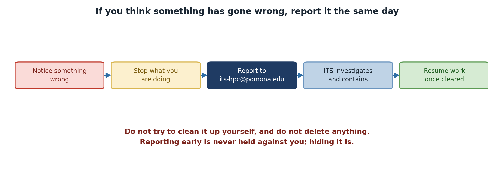

:::::::::::::::::::::::::::::::::::::: questions
- What constitutes a security incident?
- How do you report suspicious activity?
- What happens after you report an incident?
- What should you NOT do if you suspect a breach?
::::::::::::::::::::::::::::::::::::::::::::::::

::::::::::::::::::::::::::::::::::::: objectives
- Recognize security incidents
- Know how to report incidents properly
- Understand the incident response process
- Know what NOT to do during a potential incident
::::::::::::::::::::::::::::::::::::::::::::::::

## What is a Security Incident?

A security incident is any unauthorized, suspicious, or policy-violating event involving:

- **Accounts**: Unauthorized access, password breaches, credential abuse
- **Data**: Unauthorized access, exposure, theft, destruction
- **Systems**: Malware, intrusions, denial of service, compromise
- **Policy**: Violations of acceptable use or security policy
- **Suspicious activity**: Anything unusual requiring investigation

{alt='Five steps: notice something wrong, stop what you are doing, report to its-hpc@pomona.edu, ITS investigates and contains, and resume work once cleared. A warning says not to try to clean it up yourself and not to delete anything, and that reporting early is never held against you while hiding it is.'}

## Examples of Incidents

### Definitely Report

- Someone else logs into your account
- You receive suspicious DUO prompts you didn't trigger
- You find files you didn't create in your directory
- You notice unusual job activity on your account
- Someone asks for your password
- You accidentally expose sensitive data publicly
- You see someone accessing others' files
- Strange error messages or system behavior
- Account locked or access denied unexpectedly
- Data appears corrupted or missing

### Maybe Report (When Unsure)

- Unusually slow system performance
- Job failures you can't explain
- Failed login attempts in your email
- Received phishing-like email (forward to ITS)
- Unexpected changes to your home directory
- Module or software behaving strangely

**When uncertain**: Report it anyway. Better safe than sorry.

## How to Report an Incident

### Email is Best Method

**Send to**: its-hpc@pomona.edu

**Include**:

- Your name and username
- Date and time of incident
- What you observed (specific details)
- Any error messages (copy/paste exactly)
- What you did (if anything)
- How the incident affects your work
- Attachments of evidence (if applicable)

### Example Report

Subject: URGENT: Suspicious Activity on My Account

Body:

```
I believe my HPC account may be compromised.

Date/Time: March 5, 2026, 2:30 PM
Suspicious Activity: I received a DUO push notification 
that I did not trigger. I denied the prompt, but it recurred.

Details: This happened twice in 5 minutes. My password has 
not been shared, and I don't recall visiting suspicious sites.

Evidence: Screenshot attached showing DUO notification times.

Impact: I'm concerned about my research data security.

Please advise.
```

### Immediate Actions

For **very urgent** issues (active breach in progress):

1. **Email**: its-hpc@pomona.edu
2. **Also call**: ITS Help Desk [number from Pomona directory]
3. **If available**: Call HPC team directly
4. **After hours**: Campus security can escalate to on-call staff

## What Happens After You Report

### Initial Response (Within hours)

1. HPC staff acknowledges receipt
2. Staff evaluates severity
3. If critical: Immediate investigation begins
4. If routine: Scheduled for investigation

### Investigation (1-7 days depending on severity)

1. Staff reviews account logs
2. Check for unauthorized access
3. Scan for malware
4. Review file modifications
5. Gather evidence

### Resolution (3-30 days)

1. Staff determines what happened
2. Mitigating measures are implemented
3. Your account may be secured/reset
4. You're informed of findings
5. Guidance provided for future

### Severity Levels

**CRITICAL** (Investigate immediately):

- Active intrusion in progress
- Data exposure or breach
- Malware detected
- Account compromise confirmed

**HIGH** (Investigate within 24 hours):

- Suspicious DUO prompts
- Unauthorized file access
- Failed login attempts
- Potential policy violation

**MEDIUM** (Investigate within 3 days):

- Possible account issues
- Unexplained system behavior
- Minor suspicious activity

**LOW** (Routine investigation):

- Informational reporting
- Questions about security
- General concerns

## What NOT to Do During an Incident

### DON'T

- **Don't panic** - Calm assessment is needed
- **Don't cover it up** - Immediate disclosure is better
- **Don't continue working** - Stop potentially affected operations
- **Don't investigate alone** - Let professionals handle it
- **Don't delete evidence** - Log files and history matter
- **Don't share passwords** - Even with IT staff
- **Don't post publicly** - Don't announce breach on social media
- **Don't assume it will go away** - Report promptly
- **Don't delay reporting** - Earlier response is better
- **Don't accuse colleagues** - Let investigation determine facts

::::::::::::::::::::::::::::::::::::: callout
## Critical: Report First, Don't Hide

Your first instinct may be to handle it quietly or avoid "getting in trouble." DO NOT. Reporting incidents immediately is always the right choice. Covering up or delaying reporting makes things worse and can result in disciplinary action. Early reporting shows integrity and helps protect others.
::::::::::::::::::::::::::::::::::::::::::::::::

### DO

- **Do stay calm** - Most incidents are recoverable
- **Do report immediately** - Minutes matter for critical incidents
- **Do preserve evidence** - Don't delete files or logs
- **Do change password** - After reporting account compromise
- **Do disconnect from network** - If you suspect active intrusion
- **Do document observations** - Write down what you noticed
- **do cooperate with investigation** - Provide information requested
- **Do ask questions** - Understand what happened
- **Do follow guidance** - Implement security improvements
- **Do inform your PI** - Keep your advisor in the loop

## Common Incident Scenarios and Response

### Scenario 1: Unexpected DUO Prompt

**What you observe**: DUO notification you didn't trigger

**Your actions**:

1. DENY the push notification
2. Immediately change your password
3. Email its-hpc@pomona.edu with details
4. Check for unauthorized SSH sessions
5. Review recent job history

**Staff will do**: Review login logs to see if breach occurred

### Scenario 2: Someone Accessed Your Files

**What you observe**: Files you didn't create in your directory

**Your actions**:

1. Don't modify or delete the files
2. Note the file names and timestamps
3. Email its-hpc@pomona.edu with details
4. List the files: ls -la > incident_files.txt
5. Attach this list to your report

**Staff will do**: Investigate who accessed the files

### Scenario 3: Data Exposed Publicly

**What you observe**: Your data accidentally in public directory

**Your actions**:
1. STOP - Don't move or delete the data yet
2. Immediately remove public access
3. Email its-hpc@pomona.edu for urgent investigation
4. Identify exactly what was exposed
5. Notify your PI and affected parties

**Staff will do**: Check who accessed the data, issue guidance

### Scenario 4: Suspicious Email Requesting Access

**What you observe**: Email asking for credentials or access

**Your actions**:

1. DO NOT reply
2. DO NOT click links or download attachments
3. Forward email to its-hpc@pomona.edu
4. Include "PHISHING ATTEMPT" in subject
5. Delete the email

**Staff will do**: Verify legitimacy, issue warnings if needed

## Post-Incident Learning

After an incident is resolved:

### Debrief Questions

- What happened and how did I miss it?
- What warning signs should I look for?
- How can I prevent this in the future?
- Do I need additional training?
- Should my team change practices?

### Implement Improvements

Based on incident:

- Use password manager if not already
- Enable DUO if you haven't
- Review file permissions
- Implement gocryptfs for sensitive data
- Improve backup strategy
- Take additional training

## No-Blame Culture

**Important**: Reporting an incident does not result in punishment.

- Honest mistakes are forgiven
- False alarms are okay
- Learning is the goal
- Reporters are not blamed
- Cooperation is appreciated

The only thing punished is *not reporting* when you should.

::::::::::::::::::::::::::::::::::::: callout
## Safe to Report: No Blame for Honest Mistakes

If you accidentally expose data or think your password was compromised, report it. You won't be punished for honest mistakes or even false alarms. The only thing that gets people in trouble is hiding incidents. Report first, ask questions later.
::::::::::::::::::::::::::::::::::::::::::::::::

::::::::::::::::::::::::::::::::::::: challenge

## Challenge: Incident Decision-Making

For each scenario, decide: Report immediately, report today, report within a few days, or talk to PI first?

1. You notice a file in your directory you don't remember creating
2. You get an email asking you to "verify your password"
3. Your SSH login is slower than usual
4. You're waiting for results; a job completed 12 hours early
5. Your disk quota suddenly shows you've used 10 GB more than yesterday

For each, draft a 2-3 sentence report you'd send to its-hpc@pomona.edu.

:::::::::::::::::::::::::::::::: solution

1. **Unknown file in directory**: REPORT IMMEDIATELY - Could be intrusion. Report: "I found a file [filename] in my /rhome directory that I did not create. Timestamp shows [date]. Can you investigate if my account was accessed?"
2. **Email asking to verify password**: REPORT IMMEDIATELY - Phishing attempt. Report: "I received a suspicious email asking me to verify my password. [Include email headers if possible]. This appears to be a phishing attempt."
3. **SSH slower than usual**: REPORT TODAY - Performance issue, less urgent. Report: "My SSH logins have been much slower than usual for the past few hours. Is there a system issue or DDoS attack?"
4. **Job completed early**: TALK TO PI FIRST - Probably okay. May be a lucky optimization. Only report if result seems wrong or suspicious. Most likely user error in time expectation.
5. **Disk quota suddenly increased**: REPORT TODAY - Data integrity concern. Report: "My /bigdata quota shows 10 GB more usage than yesterday without my uploading data. Did a backup operation occur, or is this a potential compromise?"

:::::::::::::::::::::::::::::::::

::::::::::::::::::::::::::::::::::::::::::::::::

## Getting Help

For incident reporting or security questions:

- **Email**: its-hpc@pomona.edu
- **Phone**: ITS Help Desk (use campus directory)
- **Emergency**: Campus security can escalate
- **Questions**: No question is too basic

Remember: Reporting is ALWAYS the right choice when unsure.

::::::::::::::::::::::::::::::::::::: keypoints
- Security incidents include unauthorized access, data exposure, suspicious activity
- Report all incidents to its-hpc@pomona.edu promptly
- Include specific details: date, time, what you observed
- Do NOT investigate alone or delete evidence
- No-blame culture means reporting is encouraged
- Staff will guide you through investigation and recovery
- Learning from incidents improves security for everyone
::::::::::::::::::::::::::::::::::::::::::::::::
